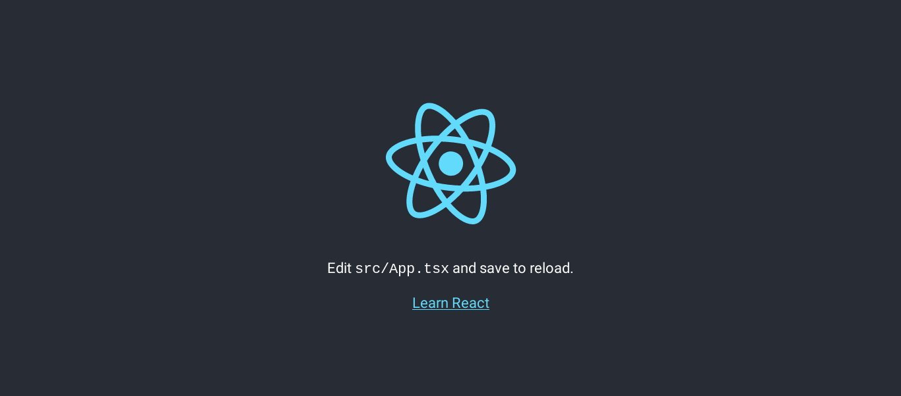

# Reactify

    

    The React Starter Kit

## Screenshots

## Usage

In the project directory, you can run:

### `pnpm start`

Runs the app in the development mode.\
Open [http://localhost:8080](http://localhost:8080) to view it in the browser.

The page will reload if you make edits.\
You will also see any lint errors in the console.

### `pnpm test`

Launches the test runner in the interactive watch mode.

### `pnpm build`

Builds the app for production to the `dist` folder.\
It correctly bundles React in production mode and optimizes the build for the best
performance.

The build is minified and the filenames include the hashes.\
Your app is ready to be deployed!

## Authors

Rakhman Abdurakhmanov - [Portfolio](https://crystallographer.github.io) |
[GitHub](https://github.com/crystallographer).

Based on [Create React App](https://create-react-app.dev) by
[Meta](https://opensource.fb.com).

## License

The MIT License - [Open Source Initiative](https://opensource.org/license/mit) |
[Free Software Directory](https://directory.fsf.org/wiki/License:Expat).
