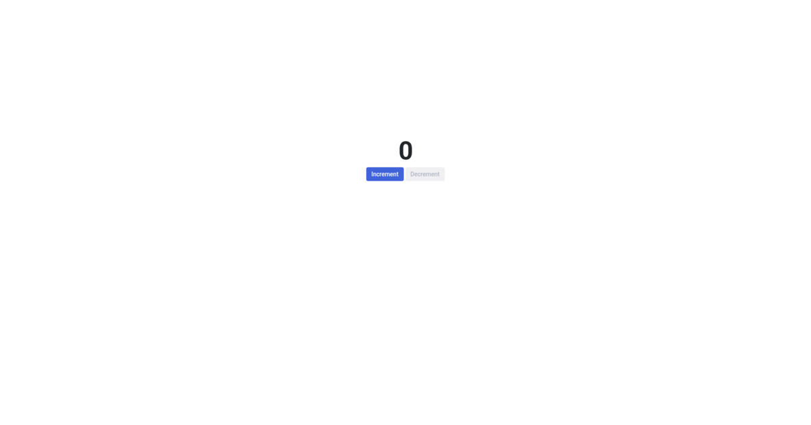

# Reactify

<div align="center">
    
    <h3 align="center">A React starter kit</h3>
</div>

## Tech Stack

<div align="center">
    
    
    
    
    
    
</div>

## Overview

This is a React starter kit.

## Screenshots

<div align="center">
    <figure>
        
        <figcaption>The homepage screenshot</figcaption>
    </figure>
</div>

## Prerequisites

Before setting up the website, make sure you have:

1. `Node.js`: a runtime environment for running the website
2. `pnpm`: a package manager for installing dependencies

## Installation

Follow these steps to set up the website:

1. Clone the repository:

    ```bash
    git clone https://github.com/madliani/reactify.git
    cd reactify
    ```

2. Install dependencies:

    ```bash
    pnpm install
    ```

3. Run tests:

    ```bash
    pnpm test
    ```

4. Build the website:

    ```bash
    pnpm build
    ```

## Project Structure

**Note:** The website is a React-based single-page application (SPA), so the
project mostly contains files of the web app.

- `assets/`: a directory containing assets for the `README.md` file
    - `assets/icons/`: a directory containing icons for the `README.md` file
    - `assets/images/`: a directory containing images for the `README.md`
- `public/`: a directory containing assets for the website
    - `assets/icons/`: a directory containing icons for the website
    - `assets/images`: a directory containing icons for the website
- `src/`: a directory containing source files of the web app
    - `src/app/`: a directory containing the root component of the web app
        - `src/app/App.tsx`: the root component of the web app
    - `src/components/`: a directory containing other components of the web app
    - `src/layouts/`: a directory containing layouts of the web app
    - `src/pages/`: a directory containing pages of the web app
    - `src/router/`: a directory containing router of the web app
    - `src/routes/`: a directory containing routes of the web app
    - `src/main.ts`: a file containing the entry point of the web app
- `types/`: a directory containing type declarations for the configuration files
    - `types/vitest.ts`: a file containing type declarations for the `Vitest`
      configuration file
- `.env`: an environment variables file (local)
- `.browserslistrc`: a `Browserslist` configuration file
- `.gitattributes`: a `Git` attributes file
- `.gitignore`: a `Git` ignore file
- `.prettierignore`: a `Prettier` ignore file
- `.stylelintignore`: a `Stylelint` ignore file
- `.tsbuildinfo`: a file of the `TypeScript` compiler for storing incremental
  compilation information (local)
- `AUTHORS.txt`: an `AUTHORS` file
- `CHANGELOG.md`: a `CHANGELOG.md` file
- `CONTRIBUTING.md`: a `CONTRIBUTING.md` file
- `cspell.config.js`: a JavaScript-based `cSpell` configuration file
- `eslint.config.js`: a JavaScript-based `ESLint` configuration file
- `index.html`: an `index.html` file
- `LICENSE.txt`: a license file
- `package.json`: a `package.json` file
- `pnpm-lock.yaml`: a `pnpm` lockfile
- `pnpm-workspace.yaml`: a `pnpm-workspace.yaml` file
- `prettier.config.js`: a JavaScript-based `Prettier` configuration file
- `README.md`: a `README` file
- `tsconfig.app.json`: a `TypeScript` configuration file for the web app
- `tsconfig.json`: a base `TypeScript` configuration file
- `tsconfig.json`: a main `TypeScript` configuration file
- `tsconfig.test.json`: a `TypeScript` configuration file for the tests
- `tsdown.config.js`: a JavaScript-based `tsdown` configuration file
- `vitest.config.js`: a JavaScript-based `Vitest` configuration file

## Branches

- `stable`: a stable branch for production builds
- `unstable`: an unstable branch for development and testing

**Note:** If you were expecting to see additional branches here, please see
[Git Workflow](./README.md#git-workflow).

## Git Workflow

This is my personal project that I'm developing alone and for my own purposes.
For that reason, a **simplified** `Git` workflow is used here.

My `Git` workflow contains the following steps:

0. Pull from the remote (optional)
1. Synchronize the `unstable` branch with the `stable` branch
2. Make a new branch for a new feature, bugfix, or hotfix from the `unstable`
   branch
3. Push branch to the remote
4. Implement the feature, bugfix, or hotfix within the branch
5. Test the feature, bugfix, or hotfix within the branch
6. Synchronize the `unstable` branch with the `stable` branch (optional)
7. Synchronize the branch with the `unstable` branch (optional)
8. Retest the feature, bugfix, or hotfix within the branch (optional)
9. Merge the branch into the `unstable` branch
10. Merge the `unstable` branch into `stable` branch
11. Make a release within the `stable` branch
12. Delete the branch
13. Push changes to the remote

**Note:** The optional steps are needed if you are developing a few features,
bugfixes, or hotfixes at the same time.

## FAQs

<details>
<summary>Under what license is the source code distributed?</summary>

The source code is distributed under the [Unlicense](./LICENSE.txt) license.

</details>

<details>
<summary>How do I start contributing to the project?</summary>

To learn about contributing to the project, see
[CONTRIBUTING.md](./CONTRIBUTING.md).

</details>

<details>
<summary>Why are some development dependencies necessary?</summary>

These dependencies are necessary for other dependencies to work correctly.

| Dependency | Purpose                                 |
| ---------- | --------------------------------------- |
| tslib      | Dependency for the `typescript` package |

</details>

## Attributions

1. In the [React logo](./assets/icons/reactify-logo.svg), used the
   [React icon](https://icon-icons.com/icon/react-original-logo/146374) by
   [Julien Monty](https://icon-icons.com/authors/934-julien-monty/) from
   [Icon-icons.com](https://icon-icons.com/).
